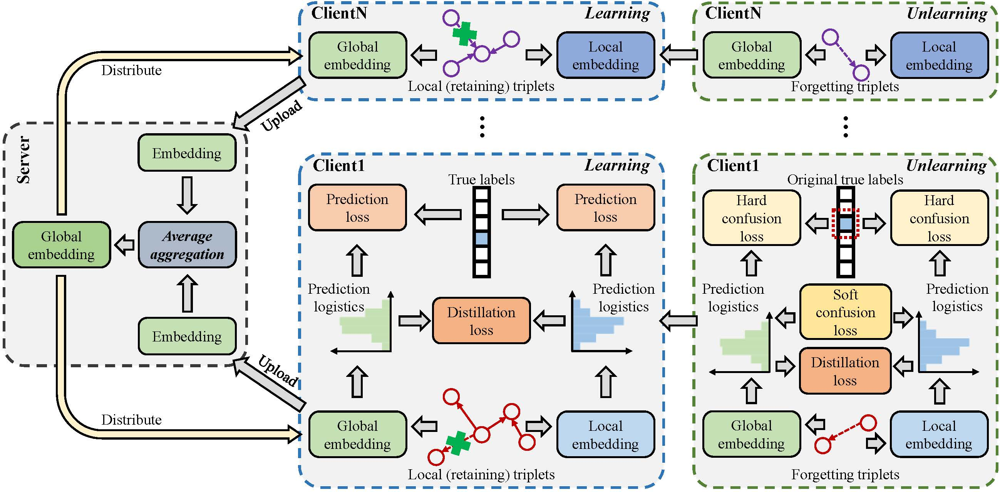

# Heterogeneous Federated Knowledge Graph Embedding Learning and Unlearning
This is the official code release of the following paper:

Xiangrong Zhu, Guangyao Li, Wei Hu. Heterogeneous Federated Knowledge Graph Embedding Learning and Unlearning, WWW 2023.

> Federated Learning (FL) recently emerges as a paradigm to train a global machine learning model across distributed clients without sharing raw data. Knowledge Graph (KG) embedding represents KGs in a continuous vector space, serving as the backbone of many knowledge-driven applications. As a promising combination, federated KG embedding can fully take advantage of knowledge learned from different clients while preserving the privacy of local data. However, realistic problems such as data heterogeneity and knowledge forgetting still remain to be concerned. In this paper, we propose FedLU, a novel FL framework for heterogeneous KG embedding learning and unlearning. To cope with the drift between local optimization and global convergence caused by data heterogeneity, we propose mutual knowledge distillation to transfer local knowledge to global, and absorb global knowledge back. Moreover, we present an unlearning method based on cognitive neuroscience, which combines retroactive interference and passive decay to erase specific knowledge from local clients and propagate to the global model by reusing knowledge distillation. We construct new datasets for assessing realistic performance of the state-of-the-arts. Extensive experiments show that FedLU achieves superior results in both link prediction and knowledge forgetting.



## Quick Start

### Installation
Install PyTorch following the instructions on the [PyTorch](https:pytorch.org/).
Our code is written in Python 3.

- numpy=1.23.0
- scipy=1.10.0
- torch=1.13.1
- networkx=3.0
- scikit_learn=1.2.1
- python_Levenshtein=0.20.9

### Learning and unlearning
```
./run_XXX.sh
./run_unlearn.sh
```
In our experiments, XXX can be filled with FedE/FedProx/FedEC/local/global and FedLU.

### Change the hyperparameters
To change the hyperparameters and other experiment set up, start from the [controller.py](Code/controller.py) and edit the script files in the [Code](Code/) folder.
We have set the same hyperparameters for all FL competitors for fair comparison.

> If you have any difficulty or question in running code and reproducing experimental results, please email to xrzhu.nju@gmail.com.

## Citation
If you find the repository helpful, please cite the following paper.
```bibtex
@inproceedings{FedLU,
  title = {Heterogeneous Knowledge Graph Embedding Learning and Unlearning},
  author = {Zhu, Xiangrong and 
            Li, Guangyao and 
            Hu, Wei},
  booktitle = {WWW},
  year = {2023}
}
```
